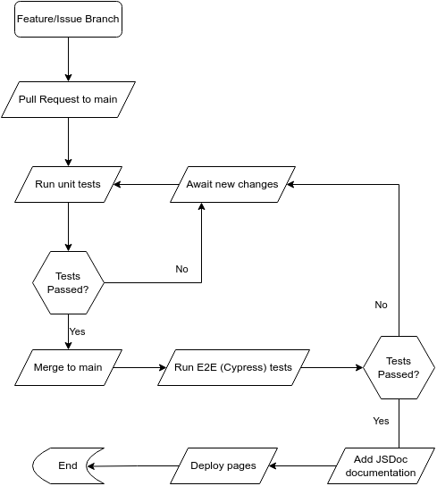

# CI/CD Pipeline - Phase 1

## Summary

The following diagram displays our planned CI/CD Pipeline. It incorporates unit testing, Cypress End-2-End testing, and JSDoc documentation to continuously maintain our repository and uphold the quality of our project. Below, we detail our current progress and planned steps to continue this integration.\
\
\
\

## Current Implementation

Currently, we have focused on building up our Cypress testing framework in parallel with GitHub Actions. With these tools, we can automatically test our project with each pull request. Our current implementation correctly triggers a GitHub workflow (right now it is triggered by a push to run more often as a part of testing, but will eventually be used only on pull requests from other branches) and will eventually run our Cypress script against the current state of our project.

## Planned Steps

Moving forward, we plan to integrate unit tests in order to ensure that future changes do not affect the individual functions and sub-processes of our applicaition. Furthermore, we will also be using JSDocs to standardize and automate documentation throughout our repository. Meanwhile, we will continue to do manual reviews of our coding style to ensure it is readable, maintainable, and adheres to our agreed upon coding style.